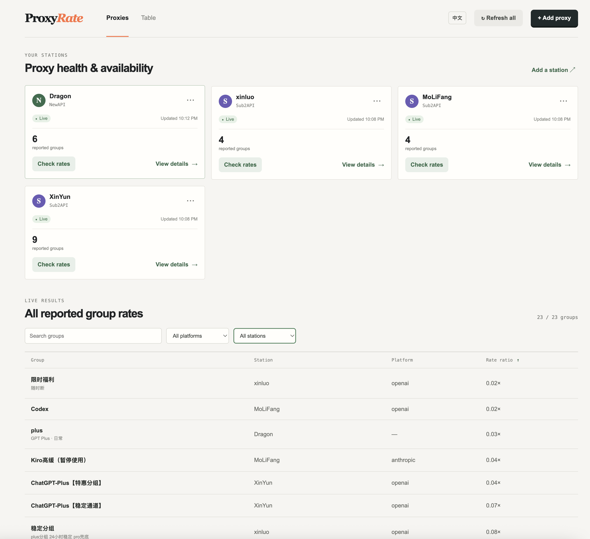

# ProxyRate

Local-first dashboard for comparing AI proxy group rates across NewAPI and Sub2API stations.



## Features

- Manage NewAPI and Sub2API stations in browser local storage
- Check and compare reported group rate multipliers
- Filter by model platform, station, or keyword; sort by rate
- English / 中文 interface and table-only view

## Run locally

```bash
npm install
npm run dev
```

Open the URL shown by Vite. The local development server relays API calls, avoiding browser CORS restrictions.

## Add a station

Enter only the station base URL, such as `https://aiccxx.cn`.

- **NewAPI** calls `/api/user/self/groups`; provide the NewAPI user ID and the value after `session=`.
- **Sub2API** calls `/api/v1/groups/available`; provide the value after `Bearer ` from the authorization header.

Credentials remain in your browser's local storage and are forwarded only when you refresh that station.

## Build

```bash
npm run build
```

The standalone UI is generated as `dist/proxyrate.html`. API checks still require a server-side relay equivalent to the local Vite bridge; static hosting alone cannot bypass upstream CORS policies.
